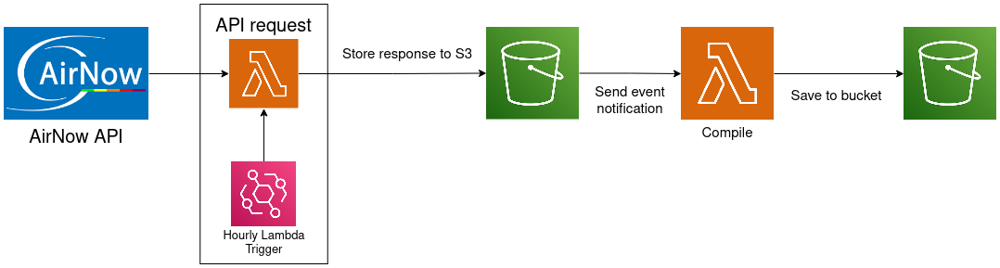
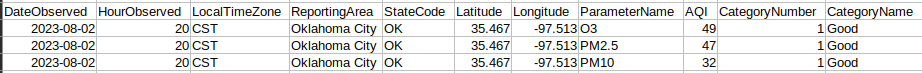
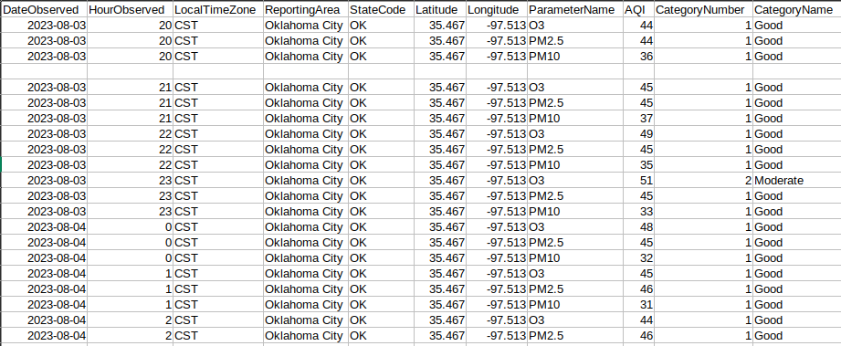

# AirQuality-AWS-Pipeline

The AWS data pipeline for AirNow API is designed to capture hourly air quality for Oklahoma City and store it for further analysis and archival. The pipeline is triggered at hourly intervals to make API requests to the AirNow service, which provides real-time air quality data for specified geographical coordinates.

## ETL DIAGRAM

## PROCESS

1. **API Request with AWS Lambda**: The pipeline starts by using AWS Lambda, triggered hourly by EventBridge. This Lambda function makes API requests to the AirNow service to fetch real-time air quality data for the specified geographical coordinates.

1. **Direct Storage to S3 Bucket**: Upon receiving the API response, the Lambda function directly stores the data in an S3 bucket. The data is stored in its raw format, ready for further processing and analysis.

1. **Event Notification to Another Lambda Function**: After successfully storing the data in the S3 bucket, the S3 bucket sends an upload event notification to another Lambda function.

1. **Combining Data using Lambda Function**: The second Lambda function processes the received data, combining the hourly response data as is.

1. **Storage to Another S3 Bucket**: Finally, the processed data is stored in another S3 bucket.

### Sample Response

### Sample Compiled file (*To be uploaded*)

